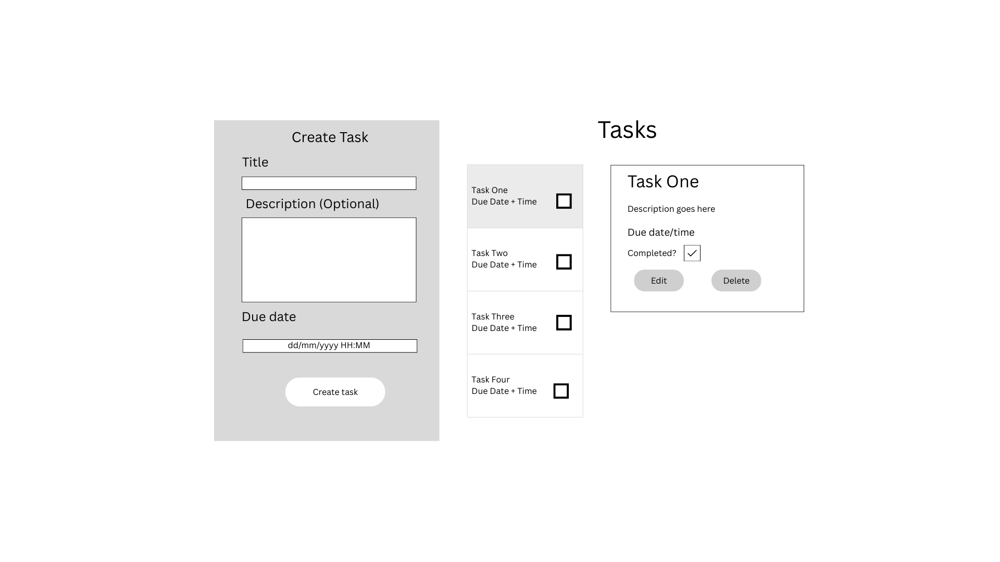

# DTS Developer Challenge - Task Manager Front End

This is the front-end for the task manager app as part of the coding challenge for the MOJ Junior Software Developer role. The front-end is written in JavaScript, using the React framework.

To view the task manager app, please type the command `npm run dev`. To ensure all API calls can be correctly made, the backend server must **also** be open. Please see the respective README for instructions on how to run the server.

## Planning

A simple wireframe was created for the layout of the task manager app.

## Components

For simplicity and time-management purposes, the app was created as a single page with three separate components all on the same page: the task form, the task list and the task detail card.

Initially, the app will load with only the task form and task list present. Each task in the list has a button which allows the user to view the task detail, appearing on the right hand side of the app. The user also has the option to close the task detail again.

Completed tasks in the list have a different UI. All tasks are listed in due date order, with the earliest dated task at the top. For further improvements, the tasks would also be filtered by their completion status for separation.

In the task detail card, the user is presented with the option to complete the task by clicking a checkbox. The user can also edit the task, which will automatically fill the task form with the relevant information. Finally, the user can delete the task.

All of the above user interactions will display user validation in a form of a toast, telling the user if the action was successfully completed, or an error occured.

### Reusable Components

Two reusable components were created for this application - a delete modal and a loading spinner.

The delete modal appears when the user clicks to delete a task, asking the user to confirm their actions. Clicking 'Yes, delete' inside the modal will create the API call to delete the selected task.

The loading spinner enhances the user experience by showing that the user's tasks are currently being fetched, rather than seemingly displaying a non-reactive application.

## Frameworks, libraries and dependencies

The task manager application was created with Vite as the build tool, using **React 19.0.10**. **Tailwind CSS 4.1.4** was used for quick and efficient styling of the app, alongside **Flowbite React 0.11.7** for reusable UI components. Below are a list of the other libraries used:

- **axios 1.9.0** - used to create and fetch API calls from the API backend.
- **react-icons** - used for adding icons to the UI
- **react-time-picker 7.0.0** - created the timepicker form input which was unavailable in Flowbite React
- **react-toastify 11.0.5** - library with pre-built toast UI and functionality, used to call toasts for user-driven events
- **jest-dom 6.6.3**, **testing-library/react** and **vitest 3.1.2** - libraries used to create test suites for unit testing

## Testing

Unit tests were created inside the **tests** folder, split into _component_ tests and _function_ tests. **Vitest** was the main testing library used to create the test suites. To run tests, please use the command `npm test` or `npm run test`. **Vitest/ui** is also downloaded to allow viewing tests directly in the browser. Please run the command `npm run test:ui` to open the browser-based test runner, which will launch in a new tab.
